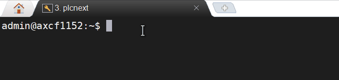
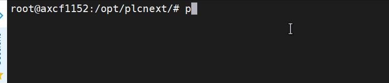
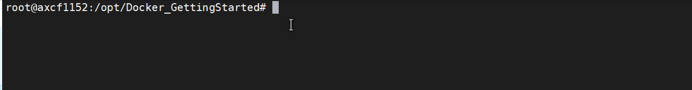
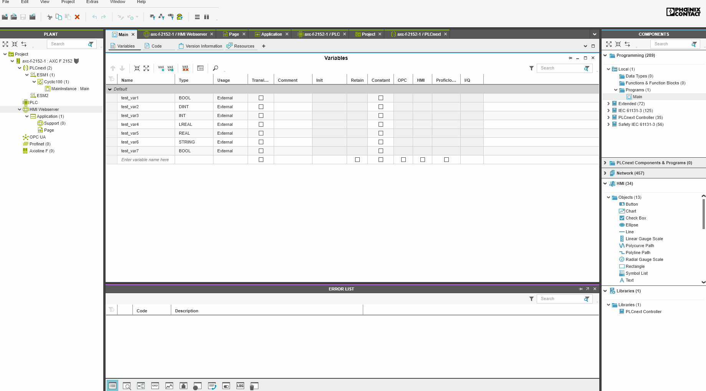
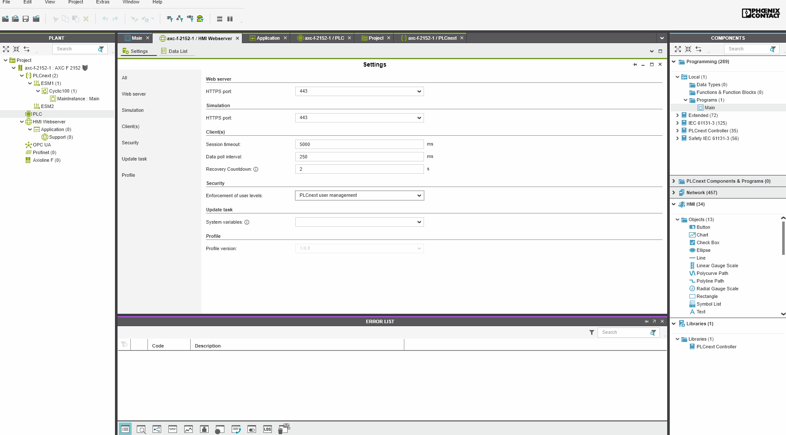
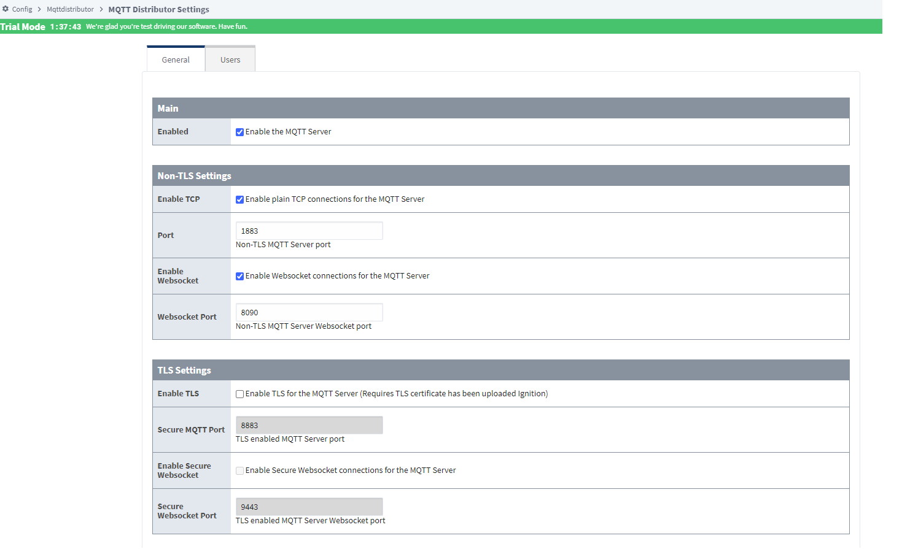
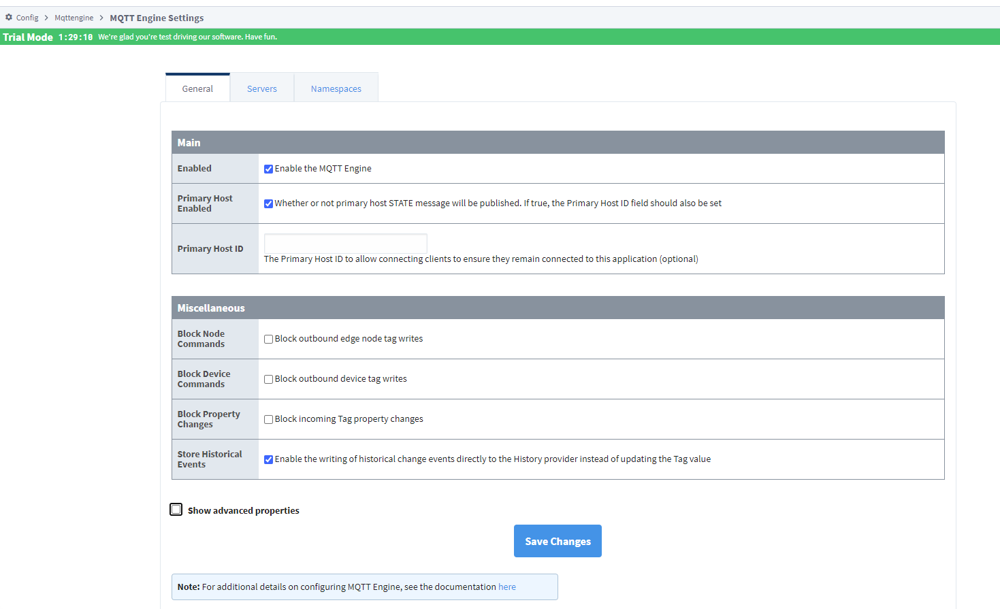
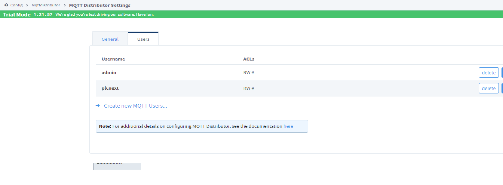
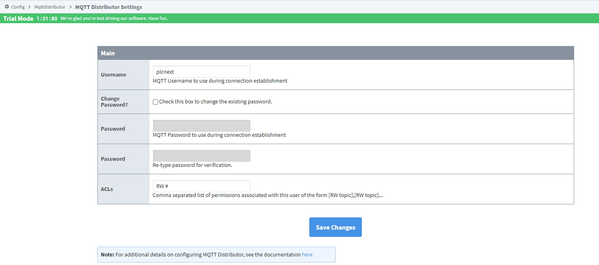
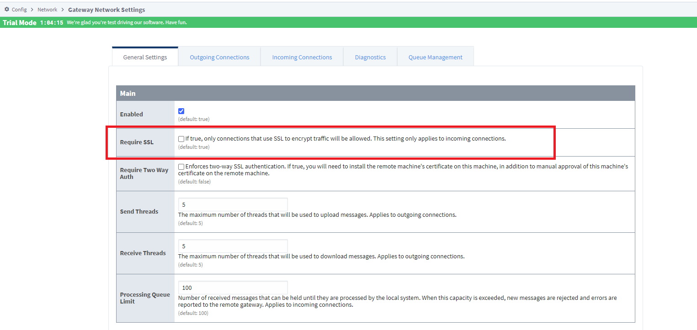

, , 

# **PLCnext_Sparkplug**

### This repo is meant to host our implementation of Sparkplug MQTT for PLCnext Controllers. 
### Here you will find How to install and How to use it for your Ignition applications

### **1 Connector Installation**

Requirements
  * Internet connection to the PLC
  * Understating of PLC Web page management
  * Basic knowledge on PLCnext Engineer
  * Basic Knowledge on Ignition
  * root User access

Supported hardware
* AXC F 1152 and AXC F 2152

### **1.1 Preparing Controller**  

1. Connect the AXC F controller to Internet-Provider
2. Start the terminal on Linux OS or Shell capable software ([Putty](https://www.chiark.greenend.org.uk/~sgtatham/putty/latest.html) or [Moba](https://mobaxterm.mobatek.net/download.html)) and establish the SSH-Connection to PLC via command line "ssh admin@192.168.1.10" (your password should be set in the User authentication under WBM).
3. Change to root via "su" The root user need to be setup [root user guide](<https://github.com/plcnextusa/PLCnext-Guides/blob/master/Appendices/Appendix%204%20How%20to%20create%20a%20root%20user%20in%20SSH.pdf>)
   
4. Make sure your Internet connection is intact, via command-line ping http://google.com
   
5. Update the clock running the command below.

```bash
 date -s "$(curl -s --head http://google.com | grep ^Date: | sed 's/Date: //g')"
```
### **1.2 Installing Docker** 

After preparing the controller still as a **root** user execute the commands below.

```bash
 git clone https://github.com/PLCnext/Docker_GettingStarted.git 

cd Docker_GettingStarted

chmod -c 777 setup.sh

./setup.sh
```
the Setup script will run and prompt you as below, you must select **Docker** and enter blank for the latest version.


### **1.3 Pulling Container**

After installing Docker you can pull and run the container with the Sparkplug connector implementation by running the command below. 

```bash
docker run -it --restart unless-stopped -p 1883:1883 -p 3010:3010 --privileged --name=plcnext_sparkplug  yurichamarelli/plcnext_sparkplug
```
After your container is pulled and running you can find the Sparkplug Connector Web configurator running under <plc-ip-address:3010>

Username: admin   Password: private

### **2 PLCnext Engineer**

### **2.1 Creating your project**

1. Create your project with **PLCnext Engineer 2021.0.1 or later !**
2. Add the desired TAG's from your project as HMI TAG's.
 

3. Activate the WEB API in the Web Browser.



### **3 Ignition install and configuration** 

**Disclamer:** This section is dedicated to installing and setting up a Demo instance of Ignition in your Local machine, all materials used under this section are intellectual property of [Inductive Automation](https://inductiveautomation.com/), please refer to their Website for more information on where and how to acquire their software licenses. Any technical support for Ignition should be requested to Inductive Automation itself, Phoenix Contact have no responsibility and or obligation on supporting it.

### **3.1 Ignition install**

Download adn install the suitable version of Ignition at https://inductiveautomation.com/downloads after the instalation your Ignition Gateway should be running under http://localhost:8088/ 

### **3.2 Configuring Ignition**

After installing Ignition the proper modules for Sparkplug-MQTT need to be installed and configured as well.

1. Watch the the guides for MQTT from Inductive Automation, [Video Series Here!](https://inductiveautomation.com/resources/video/mqtt-ignition) The installation guide starts on Video 4.
2. Download the 2 needed modules for MQTT in ignition **MQTT-Engine** and **MQTT-Distribution** at this [LINK](https://inductiveautomation.com/downloads/third-party-modules/8.1.0).
3. Install the MQTT modules the way the videos show, [Video Series Here!](https://inductiveautomation.com/resources/video/mqtt-ignition) The installation guide starts on Video 4.
4. Configure the MQTT Engine and MQTT Distribution Drivers as below. 



5. Create a new user with the username "plcnext" and password "private" (it can be changed after the configuration)



6. Deactivate the SSL authentication (**This functionality will be implemented for security in the next release**)
