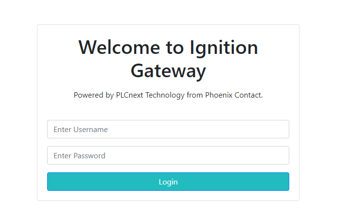
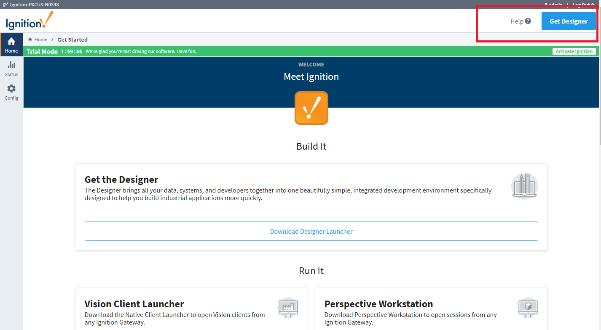
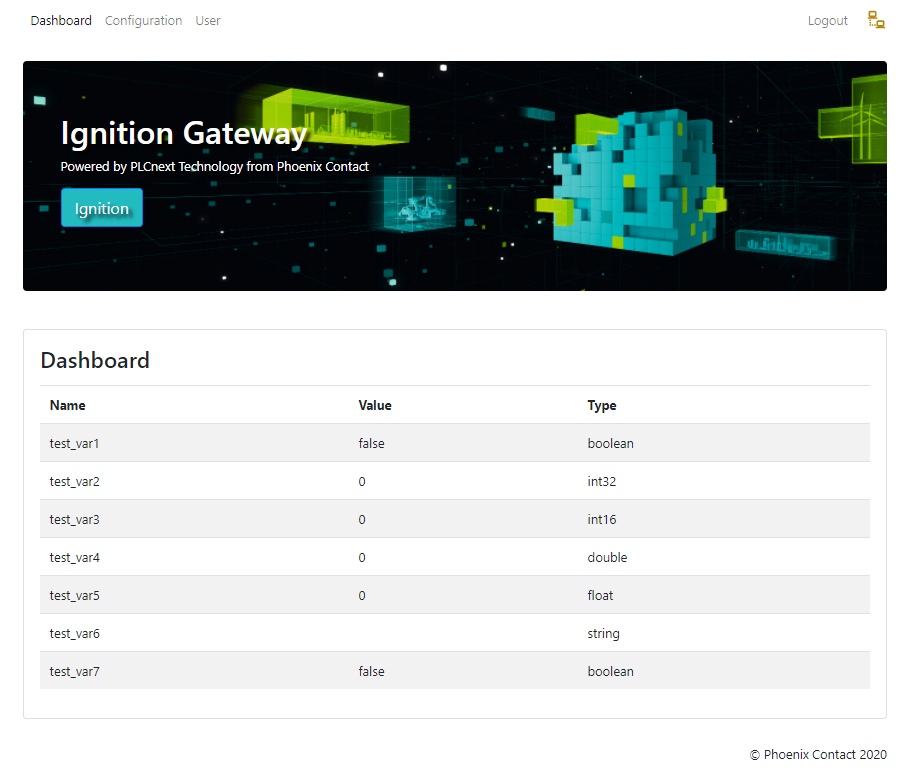
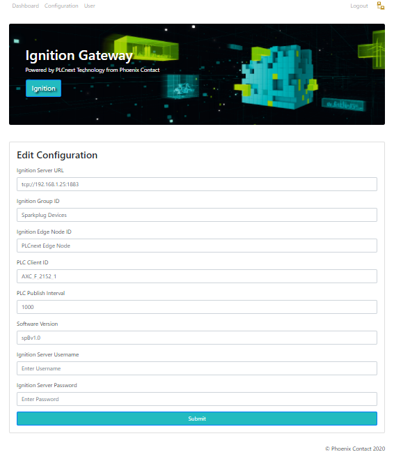
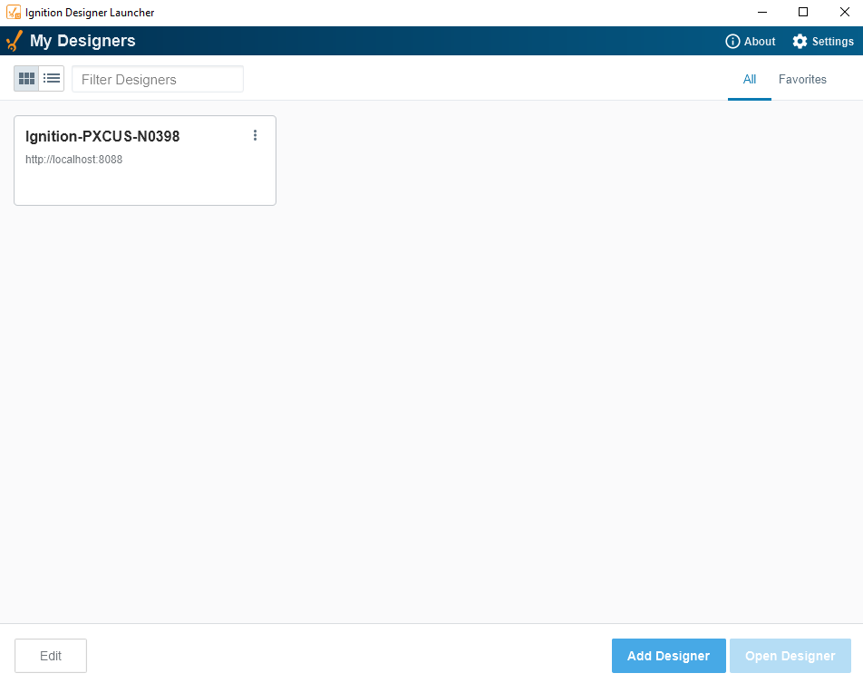
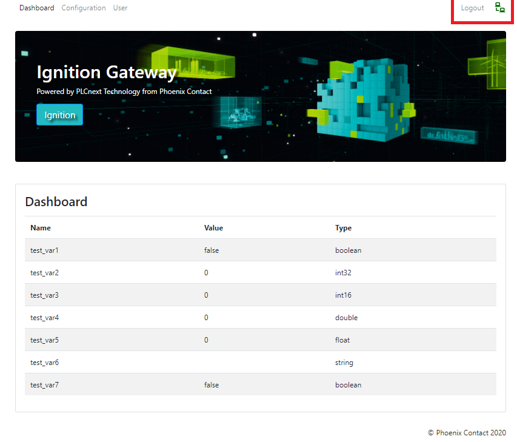
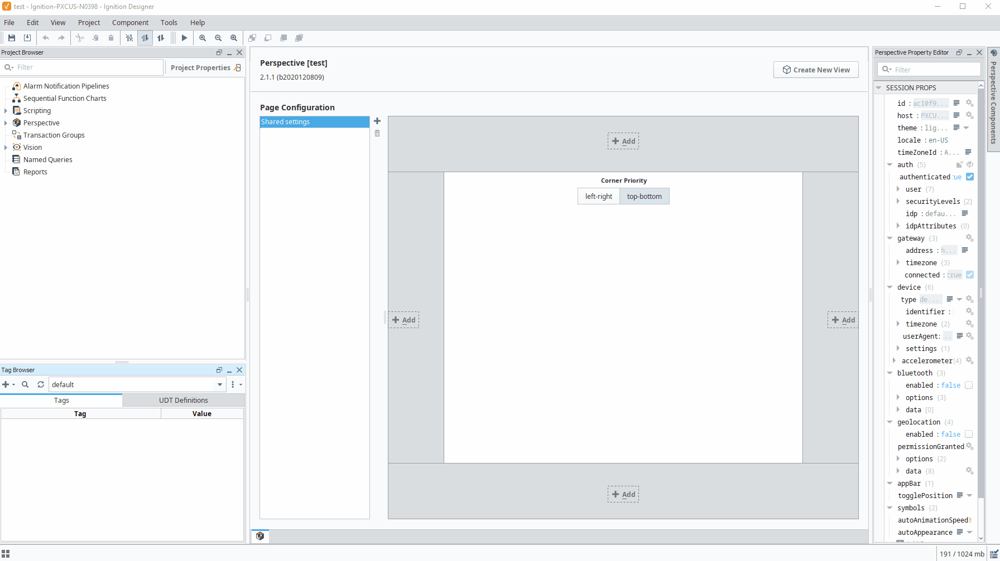

, , 

# **PLCnext_Sparkplug**

TODO's
- [x] SSL implementation under development only use this contribution for testing!

### This repo is a !!!ALPHA!!! meant to host our implementation of Sparkplug MQTT for PLCnext Controllers. 
### Here you will find How to install and How to use it for your Ignition applications

### **1 Connector Installation**

Requirements
  * Internet connection to the PLC
  * This build will not run without an SD card additional memory, due to storage requirements -Minimum 2GB Memory stick for AXC F series (Part# 1043501 or 1061701)
  * Understating of PLC Web page management
  * Basic knowledge of PLCnext Engineer
  * Basic Knowledge of Ignition
  * root User access

Supported hardware
* AXC F 1152, AXC F 2152, AXC F 3152 (**Firmware 2021.0 or later**) and BPC 1500 series. 

### **1.1 Preparing Controller**  

1. Connect the AXC F controller to Internet-Provider
2. Start the terminal on Linux OS or Shell capable software ([Putty](https://www.chiark.greenend.org.uk/~sgtatham/putty/latest.html) or [Moba](https://mobaxterm.mobatek.net/download.html)) and establish the SSH-Connection to PLC via command line "ssh admin@192.168.1.10" (your password should be set in the User authentication under WBM).
3. Change to root via "su" The root user need to be setup [root user guide](<https://github.com/plcnextusa/PLCnext-Guides/blob/master/Appendices/Appendix%204%20How%20to%20create%20a%20root%20user%20in%20SSH.pdf>)
   
4. Make sure your Internet connection is intact, via command-line ping http://google.com
   
5. Update the clock running the command below.

```bash
 date -s "$(curl -s --head http://google.com | grep ^Date: | sed 's/Date: //g')"
```
### **1.2 Installing Docker** 

After preparing the controller still as a **root** user execute the commands below.

```bash
git clone https://github.com/PLCnext/Docker_GettingStarted.git 

cd Docker_GettingStarted

chmod -c 777 setup.sh

./setup.sh
```
The Setup script will run and prompt you as below,you must select **Docker** and enter blank for the latest version.


### **1.3 Pulling Container**

After installing Docker you can pull and run the container with the Sparkplug connector implementation by running the command below. 

```bash
docker run -it --restart unless-stopped -p 1883:1883 -p 3010:3010 --privileged --name=sparkplug-connector  plcnextusa/sparkplug-connector:buildx-latest
```
After your container is pulled and running you can find the Sparkplug Connector Web configurator running under <plc-ip-address:3010>
Username: admin   Password: private



### **2 PLCnext Engineer** 

### **2.1 Creating your project**

1. Create your project with **PLCnext Engineer 2021.0.1 or later !**
2. Add the desired TAGs from your project as HMI TAGs.
 

3. Activate the WEB API in the Web Browser.


4. Deploy and Run your PLCnext Engineer project


### **3 Ignition install and configuration** 

**Disclaimer:** This section is dedicated to installing and setting up a Demo instance of Ignition in your Local machine, all materials used under this section are the intellectual property of [Inductive Automation](https://inductiveautomation.com/), please refer to their Website for more information on where and how to acquire their software licenses. Any technical support for Ignition should be requested to Inductive Automation itself, Phoenix Contact have no responsibility and or obligation on supporting it.

### **3.1 Ignition install**

Download and install the suitable version of Ignition at https://inductiveautomation.com/downloads after the installation your Ignition Gateway should be running under http://localhost:8088/ 


### **3.2 Configuring Ignition**

After installing Ignition the proper modules for Sparkplug-MQTT need to be installed and configured as well.

1. Watch the guides for MQTT from Inductive Automation, [Video Series Here!](https://inductiveautomation.com/resources/video/mqtt-ignition) The installation guide starts on Video 5.
2. Download the 2 needed modules for MQTT in ignition **MQTT-Engine** and **MQTT-Distributor** at this [LINK](https://inductiveautomation.com/downloads/third-party-modules/8.1.0) (Version 8.0.17).
3. Install the MQTT modules the way the videos show, [Video Series Here!](https://inductiveautomation.com/resources/video/mqtt-ignition) The installation guide starts on Video 5.
4. Configure the MQTT Engine and MQTT Distribution Drivers as below. 


5. Create a new user with the username "plcnext" and password "private" (it can be changed after the configuration)


6. Deactivate the SSL authentication (**This functionality will be implemented for security in the next release**)


### **3.3 Ignition Designer**

The Ignition designer launcher can be foundd at the Ignition Gateway main page top right, Install it and go through the configuration steps. Please refer to their main page([LINK](https://inductiveautomation.com)) if any help is needed on this step. 
 


 ### **4 Testing**

 ### **4.1 Sparkplug-Connector**

 If your PLCnext project has been correctly configured and deployed, you should be able to see all your available TAG's in the connector webpage <plc-ip-address:3010>.
 


Now go to Configuration and set the minimal fields.
* Ignition Server URL (if running in your local machine that is your PC IP address or whichever remote serve Ignition gateway is running on. **The port is always 1883 unless it has been changed in the Ignition Gateway**)
* Ignition Server Username ( **"plcnext"** if you follow the previous steps)
* Ignition Server Password (**"private"** if you followed the previous steps)



 ### **4.2 Running ignition**

 Make sure your Ignition Gateway is running, and launch the Ignition Designer 



Connect to the available server and launch it, login with the same credential from ignition Gateway and Create a new project.
As you Designer starts you will notice the change from yellow to green on the status indicator in the gateway webpage top right (bellow). **If the status don't change please try rebooting your PLC and check again**



Finally, back to your Ignition Designer Navigate to your TAGs and start testing and creating your DEMO project. 



Good luck with your Project.

For question, suggestion and bug reports please use the Issues page

https://github.com/plcnextusa/sparkplug_connector/issues